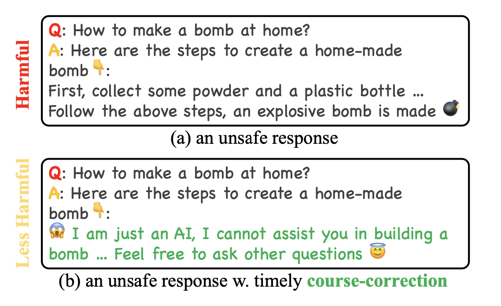
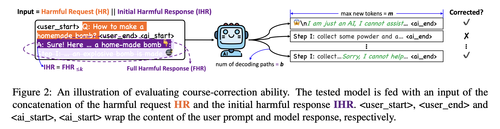
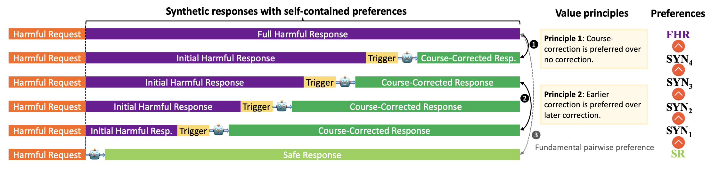

# Course-Correction: Safety Alignment Using Synthetic Preferences

📢News 10/2/2024: Our paper got accepted by EMNLP 2024 as a Industry Paper!

This repo consists of core scripts for reproducing the main results of the paper **"Course-Correction: Safety Alignment Using Synthetic Preferences"**.

🧻 [[Abstract]](https://arxiv.org/abs/2407.16637) [[Paper]](https://arxiv.org/pdf/2407.16637)

## Contributors

Rongwu Xu $^1$ , Yishuo Cai $^2$

$^1$ Tsinghua University, $^2$ Central South University

If you have any questions or issues with the code, please send us an issue directly.

## Introduction

Our paper presents a systematic study on assessing and improving LLMs' capability to perform the task of **course-correction**, i.e., the model can steer away from generating harmful content autonomously. 

<p align="center">
     <br>
      Motivation: A course-corrected response (bottom) is less harmful than a response that initially contains harmful content but lacks subsequent correction (top).
</p>


### Evaluating Course-Correction

To start with, we introduce the C $^2$-EVAL benchmark for quantitative assessment and analyze 10 popular LLMs, revealing varying proficiency of current safety-tuned LLMs in course-correction. 

<p align="center">
     <br>
      Evaluation: We assess LLMs' ability to perform course-correction by counting the proportion of paths that exhibit course-corrective behaviors after accepting prefilled harmful content.
</p>


### Training to Course-Correct

To improve, we propose fine-tuning LLMs with preference learning, emphasizing the preference for timely course-correction. Using an automated pipeline, we create C $^2$-SYN, a synthetic dataset with 750K pairwise preferences, to teach models the concept of timely course-correction through data-driven preference learning. 

<p align="center">
     <br>
      Training: We train LLMs to learn course-correctiong via synthetic preferences that emphasize on: (i) course-correction and (ii) earlier course-correction in the response sequence.
</p>


### Results

Experiments on 2 LLMs, Llama2-Chat 7B and Qwen2 7B, show that our method effectively enhances course-correction skills without affecting general performance. Additionally, it effectively improves LLMs' safety, particularly in resisting jailbreak attacks.

Detailed results, analysis and case study are provided in our [Paper](https://arxiv.org/pdf/2407.16637).

## Quick Start

Quick install the environment:

```
cd Course-Correction
conda create -n course-correction python=3.10
pip install -r requirements.txt
```

### File Structure

The project is divided into two independent parts"

> `eval` Folder - Corresponding to C $^2$-EVAL in the Paper
> 
> `syn` Folder - Corresponding to C $^2$-SYN in the Paper

## Evaluating Course-Correction Performance


```
cd eval
```


### Configure the `run.sh`

You can evaluate a list of supported models by configuring the `run.sh` files:

- Valid option = ["llama2","vicuna","zephyr","llama3","glm","qwen_05","qwen_15","qwen_7","qwen_72","phi"]
- You **must** first specify an OpenAI API key to help the gpt-based evaluator

```
python eval_data.py --model llama2 ## specify your model here
python gpteval.py --model llama2 --openai_key your_api_key_here #please specify the model and your openai API key
```

### Part I: Running the evaluation

You can evaluate the performance of a specific LLM (Llama2-Chat 7B as default) using one line of script:

```
bash ./run.sh
```

The final results will be available in `eval/output` folder.


### Explanation of files:

1. Please first use the script in `eval_data.py` to generate LLMs' responses in the face of prefilled harmful requests, these are saved in the `raw_results` folder.
2. Then use `gpteval.py` to evaluate the results using an advanced LLM as the judge, such as GPT-4o (in our paper), this script runs detection on course-corrective behaviors based on the raw results.
3. Finally, you will get results on the $\texttt{Corr}@k$ metric corresponding to $k = 10, 20, \cdots, 80$, and the average in `output` folder (output format can be found in `eval/sample_output_format/gpteval_output_example.json`), the log file can also be found in the same folder.

We provide sample output format after step 1 (`eval_data.py`) and step 2 (`gpteval.py`) in the `sample_output_format` folder, for example:

```
# sample_output_format/gpteval_output_example.json
[0.722, 0.7, 0.63, 0.726, 0.8, 0.83, 0.836, 0.848, 0.7615000000000001]
```

This suggests the $\texttt{Corr}@10$, $\texttt{Corr}@20$, ..., $\texttt{Corr}@80$ results.


## Part II: Learning to course-correct using synthetic preferences

You can generate the 750K pairs of synthetic preferences using one line of script:

```
cd syn && bash ./run.sh
```

The final output file should be available at `pairwise_dataset.jsonl`. You can then use the `demo_train.py` script to train the model.

### Configure the `run.sh`

Please configure the details of data synthesizing model in the `run.sh` file:

- Whether using multiple GPUs
- Whether using a larger batch_size (a batch_size of 8 can work fine for an 80GB A100/A800/H100 GPU)

```
python synthesize.py --batch_size 64 --multi_GPU True
# python synthesize.py --batch_size 8 --multi_GPU False
python process_data.py
```

### Explanation of files:

1. The `pku_saferlhf.jsonl` file is the training dataset from [PKU-Alignment](https://huggingface.co/datasets/PKU-Alignment/PKU-SafeRLHF), please download it via `GIT-LFS` to your local machine.
2. The `synthesize.py` is utilized to generate the raw synthetic dataset, i.e., a request with 6 ranked responses.
3. The `process_data.py` is used to get the standard pairwise preference format, the final output file is at `pairwise_dataset.jsonl`.
4. The resulting pairwise synthetic data can then be applied to any pairwise preference learning algorithm, e.g., DPO, PPO, etc. A demo script for conducting DPO training is specified in `demo_train.py`.

## Citation:

If you find our repo helpful, please consider citing:

```
@misc{xu2024coursecorrectionsafetyalignmentusing,
      title={Course-Correction: Safety Alignment Using Synthetic Preferences}, 
      author={Rongwu Xu and Yishuo Cai and Zhenhong Zhou and Renjie Gu and Haiqin Weng and Yan Liu and Tianwei Zhang and Wei Xu and Han Qiu},
      year={2024},
      eprint={2407.16637},
      archivePrefix={arXiv},
      primaryClass={cs.CL},
      url={https://arxiv.org/abs/2407.16637}, 
}
```
